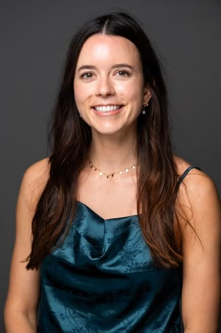

```{=html}
<div class="hero-banner">
  <div class="hero-overlay">
    <h1 class="hero-title">Kinsey Matthews</h1>
  </div>
</div>
```

::: {.about-section}

:::: {.about-grid}

::: {.about-photo}
{.headshot}

**Kinsey Matthews** (she/her)
PhD Student, Bren School
University of California, Santa Barbara
[kinseymatthews@ucsb.edu](mailto:kinseymatthews@ucsb.edu)
:::

::: {.about-text}
## About Me

I am a PhD student at the [Bren School of Environmental Science and Management](https://bren.ucsb.edu/) at UC Santa Barbara, co-advised by [Chris Free](https://chrismfree.com/) and [Steve Gaines](https://gaineslabucsb.com/). My research focuses on the relationships among marine species distributions, changing oceanographic conditions, and human uses of the ocean. I am especially interested in how adaptive and dynamic ocean management can be used to alleviate potential conflicts, such as those arising from fisheries bycatch or protected spaces.

Prior to Bren, I obtained my master's degree from Moss Landing Marine Laboratories (MLML), where my research aimed to better understand the efficacy of small-scale species distribution models of continental shelf fishes off California. After MLML, I was a California Sea Grant State Fellow with the California Fish and Game Commission, where I gained a deeper understanding of the science-policy interface and the regulatory process.

During my free time, I can be found backpacking in the Ventana Wilderness, freediving in the kelp forests, and reading fantasy books.
:::

::::

:::
