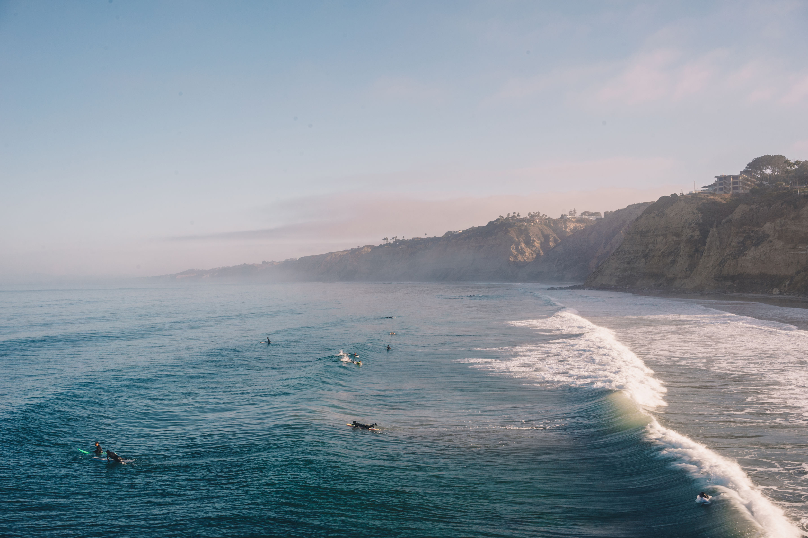
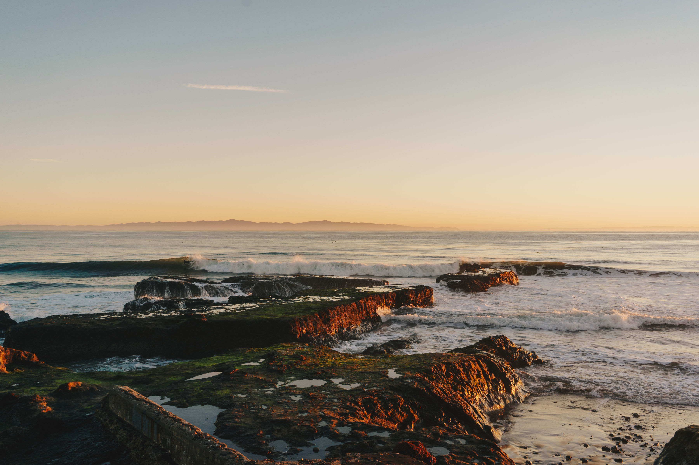
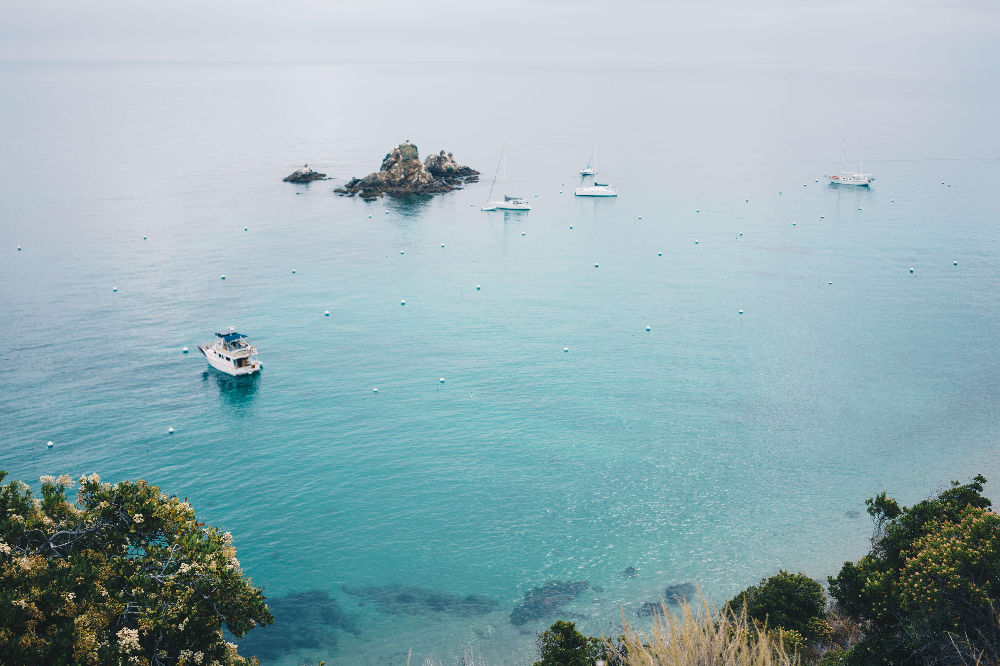

Broadly, my dissertation research addresses spatial management-related questions at the intersection of marine species distributions, climate change, and human uses of the ocean.

---

## Current Research

::: {.research-card}
:::: {.research-card-inner}
::: {.research-img}

:::
::: {.research-body}
### [Joint Dynamic Species Distribution Models to Reduce Bycatch in the Eastern Tropical Pacific](https://emlab.ucsb.edu/projects/reducing-fisheries-bycatch-eastern-tropical-pacific-ocean)

We are using joint dynamic species distribution models (JDSDMs) to model species caught as target catch and bycatch within industrial tuna fisheries in the Eastern Tropical Pacific (ETP) to characterize bycatch risk. I am leading work to forecast these interactions in near real time to identify areas that minimize bycatch while maximizing target catch.
:::
::::
:::

::: {.research-card}
:::: {.research-card-inner}
::: {.research-img}

:::
::: {.research-body}
### Climate Change and Management Impacts on California Fishing Grounds

We are measuring how the distribution of California state-managed fishing grounds changed from 1980–2024 and how management, market forces, and climate variability influence those changes.
:::
::::
:::

::: {.research-card}
:::: {.research-card-inner}
::: {.research-img}

:::
::: {.research-body}
### Connectivity of Highly Migratory Species Within West Coast National Marine Sanctuaries

We will evaluate highly migratory species (HMS) habitat use and connectivity across California's National Marine Sanctuary (NMS) network and forecast HMS distributions under climate change scenarios to understand how habitat use of NMS waters might change in the future.
:::
::::
:::

---

## Past Research

**Master's Research — Moss Landing Marine Laboratories**
My master's research aimed to better understand the efficacy of small-scale species distribution models of continental shelf fishes off California, using stereo-video landers to rapidly assess fish diversity and community assemblages.

**California Sea Grant State Fellowship — CA Fish and Game Commission**
As a Sea Grant State Fellow, I worked at the California Fish and Game Commission, gaining hands-on experience at the science-policy interface and in the regulatory process for California fisheries management.
